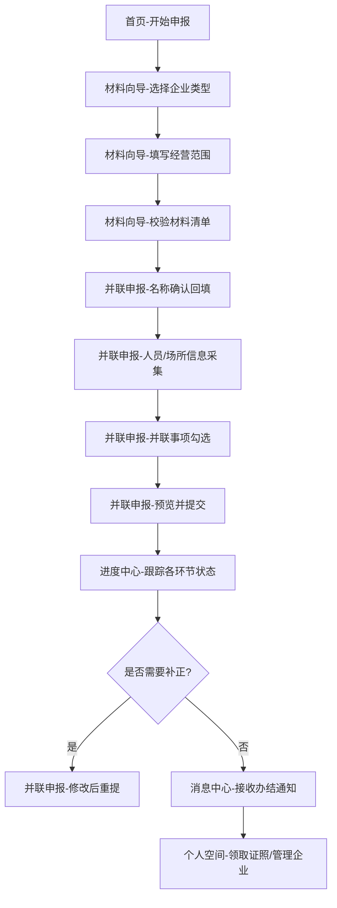

## 1. 产品概述

企业开办一窗通是面向首次创业者的一站式企业开办 Web 应用，整合营业执照办理、刻章备案、税务登记、社保开户、公积金开户、银行预约六大事项，通过一次填报并联审批，解决创业者"不会填、怕漏填、反复跑"的痛点。

- 目标用户：首次创业者、新设企业经办人
- 核心价值：降低开办门槛、减少重复填报、压缩办理时间、透明化进度

## 2. 核心功能

### 2.1 用户角色

| 角色 | 注册方式 | 核心权限 |
|------|---------|---------|
| 创业者/经办人 | 手机号实名认证 | 发起开办申请、填报信息、上传材料、查看进度、接收消息 |

### 2.2 功能模块

1. **首页**：开办路径引导、快捷入口、进度概览、政策资讯
2. **材料向导**：企业类型选择、经营范围智能匹配、材料清单校验、模板下载
3. **并联申报**：名称自主申报回填、法人/股东/场所信息统一采集、多事项并联提交
4. **进度中心**：各环节状态展示、补正提示、办理节点时间线
5. **消息中心**：领照提醒、刻章通知、开户预约、退回补正消息推送
6. **个人空间**：历史申报记录、任务清单、企业信息管理、分支机构设立

### 2.3 页面详情

| 页面名称 | 模块名称 | 功能描述 |
|---------|---------|---------|
| 首页 | 顶部导航 | 六大页面入口、用户登录/注册、消息通知 |
| 首页 | 开办引导区 | 企业类型卡片选择、开办流程步骤图、开始申报按钮 |
| 首页 | 进度概览 | 当前办理企业的进度条、各环节状态标记 |
| 首页 | 政策资讯 | 最新开办政策、常见问题 FAQ、热点问答 |
| 材料向导 | 企业类型选择 | 有限责任公司/个体工商户/合伙企业等类型卡片 |
| 材料向导 | 经营范围匹配 | 关键词搜索、自动推荐、许可事项提示 |
| 材料向导 | 材料清单 | 逐项校验、缺失标记、上传入口、模板下载 |
| 材料向导 | 材料整理 | 身份证明上传、租赁材料整理、公司章程在线编辑 |
| 并联申报 | 名称申报 | 名称自主申报结果回填、企业名称确认 |
| 并联申报 | 人员信息 | 法人、股东、监事信息统一采集、身份核验 |
| 并联申报 | 经营场所 | 地址信息填写、房产证明上传、住所申报 |
| 并联申报 | 事项勾选 | 营业执照/刻章/税务/社保/公积金/银行并联勾选 |
| 并联申报 | 提交确认 | 信息预览、电子签名、一键提交 |
| 进度中心 | 进度时间线 | 各环节受理/审核/退回/办结状态展示 |
| 进度中心 | 环节详情 | 办理部门、预计时限、当前状态说明 |
| 进度中心 | 补正入口 | 退回原因展示、修改表单、重新提交 |
| 进度中心 | 证照下载 | 电子营业执照下载、刻章领取凭证 |
| 消息中心 | 分类消息 | 办件通知、政策提醒、系统公告分类标签 |
| 消息中心 | 消息列表 | 时间倒序、未读标记、消息摘要 |
| 消息中心 | 消息详情 | 完整内容、跳转相关页面、附件下载 |
| 个人空间 | 企业列表 | 已开办企业卡片、状态标签、快捷操作 |
| 个人空间 | 任务清单 | 待办事项、已完成事项、时间节点提醒 |
| 个人空间 | 历史记录 | 申报历史、变更记录、补报记录 |
| 个人空间 | 分支机构 | 一键复用信息、快速设立分支机构 |

## 3. 核心流程

用户从首页选择企业类型开始，经过材料向导确认所需材料，在并联申报页面完成所有信息采集和材料上传，一键提交后通过进度中心跟踪办理状态，通过消息中心接收各节点通知，最终在个人空间管理所有企业和申报记录。

## 4. 用户界面设计

### 4.1 设计风格

- 主色调：政务蓝（#1E56A0）作为主色，体现权威和可信赖
- 辅助色：安全绿（#22A06B）表示完成/通过，警示橙（#F59E0B）表示待办/补正，错误红（#DC2626）表示退回/错误
- 中性色：以 Zinc 系列灰阶为基底，层次分明
- 按钮风格：圆角 8px，实心主色按钮配 hover 微提亮，次要按钮采用描边样式
- 字体：标题使用思源黑体 Bold，正文使用思源黑体 Regular，字号层级清晰（12/14/16/20/24/32）
- 布局风格：顶部导航栏 + 左侧步骤导航（申报页）+ 主内容区，卡片式布局，信息分组明确
- 图标：使用 Lucide 线性图标，风格统一简洁
- 动效：页面切换淡入过渡、步骤进度条平滑动画、hover 状态微提升

### 4.2 页面设计概览

| 页面名称 | 模块名称 | UI 元素 |
|---------|---------|---------|
| 首页 | 开办引导区 | 渐变蓝色背景 Hero 区、大标题、4 步流程时间线、企业类型卡片网格 |
| 首页 | 进度概览 | 横向步骤条、状态图标、百分比进度、下一个待办提示 |
| 材料向导 | 企业类型选择 | 卡片网格、图标+标题+描述、选中高亮边框 |
| 材料向导 | 材料清单 | 可折叠分组、对勾/警告/缺失图标、进度百分比、上传按钮 |
| 并联申报 | 步骤导航 | 左侧垂直步骤条、当前步骤高亮、已完成对勾、表单分组卡片 |
| 并联申报 | 人员信息 | 表单标签 + 输入框、证件上传预览区、添加股东按钮 |
| 进度中心 | 时间线 | 左侧垂直时间线、状态色点、节点标题、状态标签、详细信息面板 |
| 消息中心 | 消息列表 | 分类标签切换、未读红点、消息卡片（标题+摘要+时间） |
| 个人空间 | 企业列表 | 企业卡片网格、企业名称+统一社会信用代码、状态标签、快捷操作按钮组 |

### 4.3 响应式

采用桌面优先设计，主断点 1280px/1024px/768px：
- ≥1280px：四栏信息布局，步骤导航独立侧边
- 1024-1280px：三栏布局，压缩间距
- 768-1024px：两栏布局，步骤导航折叠为顶部横向
- <768px：单栏堆叠布局，汉堡菜单
