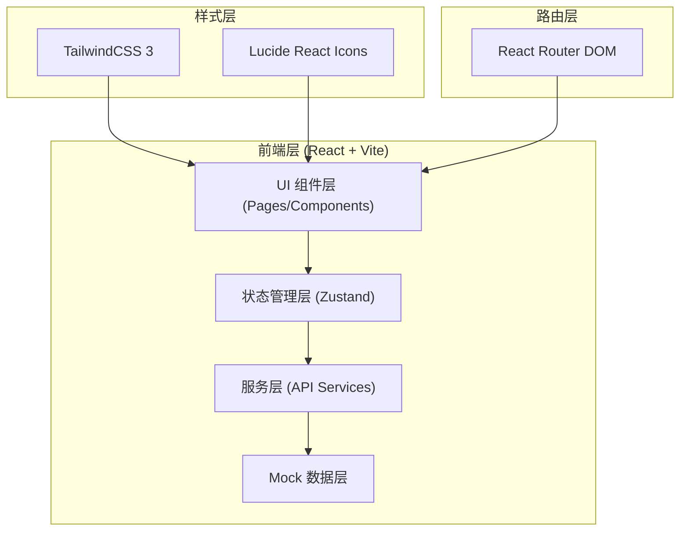

## 1. 架构设计



## 2. 技术描述

- 前端框架：React 18 + TypeScript
- 构建工具：Vite 5
- 样式方案：TailwindCSS 3
- 路由管理：React Router DOM 6
- 状态管理：Zustand 4
- 图标库：Lucide React
- 数据方案：前端 Mock 数据（模拟后端接口）
- 初始化方式：vite-init react-ts 模板

## 3. 路由定义

| 路由 | 页面 | 用途 |
|------|------|------|
| / | 首页 | 开办引导、快捷入口、进度概览 |
| /material-guide | 材料向导 | 企业类型选择、经营范围匹配、材料清单校验 |
| /application | 并联申报 | 信息采集、并联事项勾选、一键提交 |
| /progress | 进度中心 | 各环节状态跟踪、补正入口 |
| /messages | 消息中心 | 分类消息列表、消息详情 |
| /dashboard | 个人空间 | 企业管理、任务清单、历史记录 |

## 4. 数据模型

### 4.1 核心类型定义

```typescript
// 企业类型
type EnterpriseType = 'limited' | 'individual' | 'partnership' | 'sole';

// 办理状态
type ProcessStatus = 'pending' | 'accepted' | 'reviewing' | 'returned' | 'completed';

// 办理环节
type ProcessStage = 'name_approval' | 'business_license' | 'seal_engraving' | 'tax_registration' | 'social_insurance' | 'housing_fund' | 'bank_appointment';

// 人员信息
interface Person {
  id: string;
  name: string;
  idType: string;
  idNumber: string;
  phone: string;
  email: string;
  role: 'legal_representative' | 'shareholder' | 'supervisor' | 'director';
  idCardFront?: string;
  idCardBack?: string;
}

// 股东信息
interface Shareholder extends Person {
  shareRatio: number;
  subscribedCapital: number;
}

// 经营场所
interface BusinessPremises {
  province: string;
  city: string;
  district: string;
  address: string;
  propertyType: 'owned' | 'rented' | 'provided';
  propertyOwner: string;
  propertyCertType: string;
  propertyCertNo: string;
  leaseTermStart?: string;
  leaseTermEnd?: string;
  propertyCertFile?: string;
  leaseContractFile?: string;
}

// 经营范围
interface BusinessScopeItem {
  code: string;
  name: string;
  category: string;
  isLicensed: boolean;
  licenseRequired?: string;
}

// 材料清单
interface MaterialItem {
  id: string;
  name: string;
  category: string;
  required: boolean;
  status: 'missing' | 'uploaded' | 'verified';
  uploadedFile?: string;
  templateAvailable: boolean;
  templateFile?: string;
  remark?: string;
}

// 办理环节进度
interface ProcessStep {
  stage: ProcessStage;
  name: string;
  status: ProcessStatus;
  acceptTime?: string;
  expectedTime?: string;
  completeTime?: string;
  department: string;
  handler?: string;
  returnReason?: string;
  correctItems?: string[];
}

// 企业开办申请
interface EnterpriseApplication {
  id: string;
  applicationNo: string;
  enterpriseName: string;
  alternativeNames?: string[];
  enterpriseType: EnterpriseType;
  registeredCapital: number;
  businessScope: BusinessScopeItem[];
  businessTerm: string;
  legalRepresentative: Person;
  shareholders: Shareholder[];
  supervisors: Person[];
  directors: Person[];
  premises: BusinessPremises;
  selectedServices: ProcessStage[];
  materials: MaterialItem[];
  processSteps: ProcessStep[];
  status: ProcessStatus;
  createTime: string;
  submitTime?: string;
}

// 消息
interface Message {
  id: string;
  type: 'process' | 'policy' | 'system';
  title: string;
  content: string;
  isRead: boolean;
  createTime: string;
  relatedApplicationId?: string;
  relatedStage?: ProcessStage;
  attachmentName?: string;
}

// 企业信息（已设立）
interface Enterprise {
  id: string;
  name: string;
  unifiedCreditCode: string;
  type: EnterpriseType;
  establishDate: string;
  status: 'normal' | 'abnormal' | 'cancelled';
  legalRepresentative: string;
  registeredCapital: number;
  address: string;
  businessScope: string;
}

// 用户任务
interface UserTask {
  id: string;
  title: string;
  description: string;
  type: 'todo' | 'reminder';
  deadline?: string;
  status: 'pending' | 'completed';
  relatedPage?: string;
}
```

### 4.2 状态管理 (Zustand Store)

```typescript
interface AppState {
  // 当前申请
  currentApplication: EnterpriseApplication | null;
  // 申请列表
  applications: EnterpriseApplication[];
  // 已设立企业列表
  enterprises: Enterprise[];
  // 消息列表
  messages: Message[];
  // 用户任务
  tasks: UserTask[];
  // 方法
  setCurrentApplication: (app: EnterpriseApplication | null) => void;
  updateApplication: (id: string, updates: Partial<EnterpriseApplication>) => void;
  submitApplication: (id: string) => void;
  addMessage: (msg: Message) => void;
  markMessageRead: (id: string) => void;
  toggleTask: (id: string) => void;
}
```

## 5. 项目目录结构

```
src/
├── components/          # 通用组件
│   ├── Layout/         # 布局组件（Header、Sidebar、Footer）
│   ├── Form/           # 表单组件（Input、Upload、Select 等）
│   ├── Progress/       # 进度相关组件
│   ├── Card/           # 卡片组件
│   └── common/         # 其他通用组件
├── pages/              # 页面组件
│   ├── Home.tsx        # 首页
│   ├── MaterialGuide.tsx # 材料向导
│   ├── Application.tsx # 并联申报
│   ├── Progress.tsx    # 进度中心
│   ├── Messages.tsx    # 消息中心
│   └── Dashboard.tsx   # 个人空间
├── hooks/              # 自定义 Hooks
├── store/              # Zustand 状态管理
│   └── index.ts
├── types/              # TypeScript 类型定义
│   └── index.ts
├── data/               # Mock 数据
│   ├── mockData.ts
│   └── enterpriseTypes.ts
├── utils/              # 工具函数
├── App.tsx             # 根组件
├── main.tsx            # 入口文件
└── index.css           # 全局样式
```
